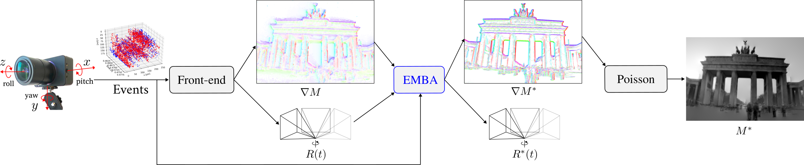

# Event-based Mosaicing Bundle Adjustment
Official repository for [**Event-based Mosaicing Bundle Adjustment**](https://arxiv.org/pdf/2403.08119), **ECCV 2024 paper**, by [Shuang Guo](https://www.linkedin.com/in/shuang-guo-00b664266) and [Guillermo Gallego](https://sites.google.com/view/guillermogallego).
<h2 align="left">

[Video](https://youtu.be/LFsDjS1yrG8) | [Dataset](https://github.com/tub-rip/ECRot)
</h2>

[](https://youtu.be/LFsDjS1yrG8)


## Citation

If you use this work in your research, please cite it as follows:

```bibtex
@InProceedings{Guo24eccv,
  author        = {Shuang Guo and Guillermo Gallego},
  title         = {Event-based Mosaicing Bundle Adjustment},
  booktitle     = {European Conference on Computer Vision (ECCV)},
  pages         = {1--14},
  doi           = {},
  year          = 2024
}
```

-------
## Setup

### High-level Input-Output

**Input**:
- Events.
- Camera calibration.
- Initial trajectory from other front-end methods.
- (Optional) Initial panoramic gradient maps.

**Output**:
- Refined rotations of the event camera.
- Refined intensity panorama.

## Usage
- [Installation](docs/installation.md)
- [Execution](docs/execution.md)
- [Parameter Guide](docs/parameters.md)

## [Event Camera Rotation Dataset (ECRot)](https://github.com/tub-rip/ECRot)

We test EMBA on the newly-released ECRot dataset, see and download it at [here](https://github.com/tub-rip/ECRot). The instructions of running EMBA on the ECRot datasets can be found [here](docs/execution.md).

## Acknowledgements

This code leverages the following repository for computing the derivative of Lie Group B-splines:
- [Basalt Headers](https://gitlab.com/VladyslavUsenko/basalt-headers)


## Additional Resources

* [Research page (TU Berlin RIP lab)](https://sites.google.com/view/guillermogallego/research/event-based-vision)
* [Course at TU Berlin](https://sites.google.com/view/guillermogallego/teaching/event-based-robot-vision)
* [Survey paper](http://rpg.ifi.uzh.ch/docs/EventVisionSurvey.pdf)
* [List of Resources](https://github.com/uzh-rpg/event-based_vision_resources)
